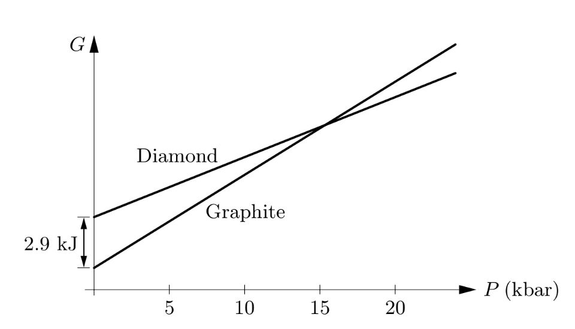

# 5.3 Phase Transformation of Pure Substances

Phase transformation会导致物体性质不连续的变化，而同时它所处的环境是连续变化的，例如把一杯水冻成冰，它的密度是突变的，但是环境温度却是连续变化到零下的。

一般来说，能够影响物体相的物理量有很多，例如温度、压强，我们可以降温使水结冰，同时也可以通过加压实现相同目的。Phase diagram就是分别以温度与压强为坐标的图像，通过读取phase diagram,我们可以得知某种物体在某个给定压强与温度状态下的相.

水的Phase diagram

图中，气态能够与固态或液态共存的点的气压称为vapor pressure，固液气态共存的点称为triple point. 固液分界线的斜率与该物质的密度有关。另外，气液交界处有一个critical point，在该点以上，气体与液体将变得无法分辨

# Diamonds and Graphite

碳有两种相，一种是graphite（石墨），另一种是diamond（钻石），在通常的环境下钻石会自发地向石墨转变（当然室温下这个过程进行的很慢，高温下就会很快，比如把钻石扔到火里）

在标准情况下，1mol石墨的Gibbs free energy比钻石要小$2900\ \text{J}$，但是考虑到

$$
(\dfrac{\partial G}{\partial P})_{T,N}=V
$$

我们又知道，钻石的密度比石墨大一些，所以在$G-P$图像上，钻石的斜率就会小于石墨的，因此，二者的图像就会有一个交叉点，在该点以上，钻石将比石墨更稳定。

这个交点大概在$15\ \text{kbar}$左右，自然界中，岩石的密度大概是$3 \times 10^3 \ \text{kg/m}^3$，也就是大概每$10\ \text{m}$，压强就会增加$3\ \text{kbar}$，因此想要达到$15\text{kbar}$，大概需要$50\ \text{km}$的深度

关于温度

$$
(\dfrac{\partial G}{\partial T})_{P,N}=-S
$$

由于单位质量的石墨熵更高，因此升温时，石墨的Gibbs free energy下降更快，会更加稳定，因此，温度越高，钻石越容易变成石墨。

# The Clausius-Claperyron Relation

考虑两相的边界，它两侧的Gibbs free energy是相同的，否则就会发生向低Gibbs free energy方向的相变，也即

$$
G_l=G_g
$$

在边界上成立，考虑微小的温度变化

我们有

$$
\text{d}G_l=\text{d}G_g
$$

因此，根据我们的thermodynamic identity，有

$$
-S_l \text{d}T+V_l\text{d}P=-S_g\text{d}T+V_l\text{d}P
$$

整理可得

$$
\dfrac{\text{d}P}{\text{d}T}=\dfrac{S_g-S_l}{V_g-V_l}
$$

这正是上图的斜率，由相变时的熵变$S_g-S_l=\dfrac{L}{T}$，带入可得

$$
\dfrac{\text{d}P}{\text{d}T}=\dfrac{L}{T\Delta V}
$$

这就是Clausius-Clapeyron relation.

# The van der Walls Model

$$
(P+\dfrac{aN^2}{V^2})(V-Nb)=NkT
$$

Van der Walls equation由Johannes van der Walls在1873年提出，它近似考虑了气体之间的相互作用。

和理想气体方程相比主要差异在$aN/V^2$与$Nb$上，其中$Nb$项很容易理解，这就是气体分子占据的体积，其中系数$b$就是单个分子占据的有效体积。

而$aN/V^2$是由于分子在靠近时，会有分子引力导致的项。

我们先考虑一个含有很多分子的系统，假设所有分子都被冻结，静止。如果我们体积不变，分子数扩大一倍，那显然每个分子周围的分子数也会变为原来两倍，因此它们的势能变为原来两倍。而又由于总的分子数也扩大了两倍，因此总的能量扩大了四倍，因此总能量正比于分子数平方；如果我们控制分子数不变，将体积变为原来的一半，那每个分子接触的分子也会变为原来两倍，总能量翻倍，因此总能量反比与体积。最终，我们就有

$$
总能量=-\dfrac{aN^2}{V}
$$

又由于$\text{d}U=-P\text{d}V$，我们就能得到

$$
P_{附加}=-\dfrac{\text{d}}{\text{d}V}(-\dfrac{aN^2}{V})=-\dfrac{aN^2}{V^2}
$$

因此，我们有

$$
P=P_0+P_{附加}=\dfrac{NkT}{V-Nb}-\dfrac{aN^2}{V^2}
$$

整理后便是van der Walls equation

此外，我们可以把常数$a$理解为平均的相互作用能乘上分子的有效体积，例如对于氮气，我们有$a \approx 2.5\ \text{eV}\cdot \text{\r{A}}^3$，和我们预测的数量级相近。

等温曲线

我们可以发现，在某些位置，随着体积的增大，压强是增大的，而这显然是不合理的，但是实际上，这并不是van der Walls model的结果。

考虑一坨van der Walls流体的Gibbs free energy

$$
\text{d}G=-S\text{d}T+V\text{d}P+\mu \text{d}N
$$

对于固定的物体，固定的温度，我们有

$$
(\dfrac{\partial G}{\partial V})_{N,T}=V(\dfrac{\partial P}{\partial V})_{N,T}
$$

将van der Walls equation带入上式右边，我们有

$$
(\dfrac{\partial G}{\partial V})_{N,T}=-\dfrac{NktV}{(V-Nb)^2}+\dfrac{2aN^2}{V^2}
$$

上式对$V$积分，有

$$
G=-NkT\text{ln}(V-Nb)+\dfrac{(Nkt)(Nb)}{V-Nb}-\dfrac{2aN^2}{V}+c(T)
$$

由该式与van der Walls equation, 我们就能得到$N,T$不变时的$G-P$曲线

因此，我们可以看到，当压强增加时，状态点实际上并不沿着1-2-3-4-5-6-7移动，而是直接1-2-6-7移动（$G$总取最小值），因此$P-V$图像上有些绘制出的曲线并不会被经过。

而我们知道，沿着2-3-4-5-6的路径走，$G$的变化量为$0$（左图），因此，我们有

$$
0=\int_{loop}\text{d}G=\int_{loop}(\dfrac{\partial G}{\partial P})_T\text{d}P=\int_{loop}V\text{d}P
$$

我们把$P-V$图像转一下

上式的意义就是A区域和B区域的面积相等

画这条直线的过程叫做Maxwell construction

把许多温度下的情况画出来，我们就得到了下图

灰色区域就是相变区域，灰色区域的顶点正对应了右图的critical point，也即恰好不发生相变的点。